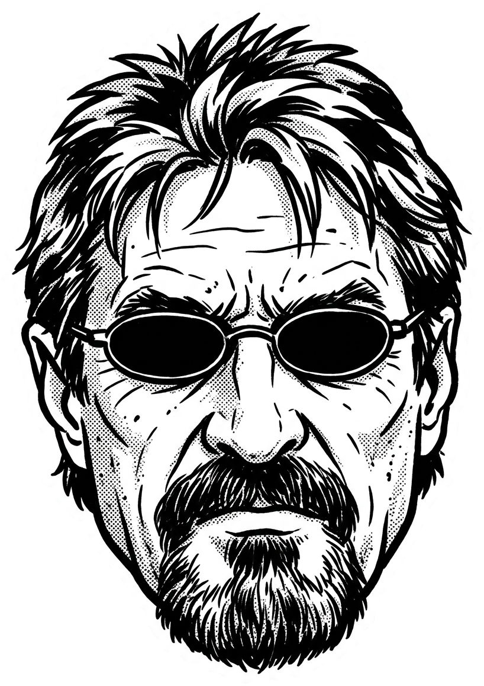

<div align="center">



# Security Engineer

**The security software engineer your build never had.**

Thirteen layers, decided. Every mandatory control shipped with a check that proves it. All while the
fix is still one line of config instead of a migration, a credential rotation, and an apology to
your users.

Most security tooling shows up after the fact and hands you a list. This one sits with you while the
system is designed and built, and makes it come out right the first time.


<sub>Last updated <b>2026-08-17 10:33 (UTC-3)</b>, version <b>1.1.0</b></sub>

[Portugu&ecirc;s do Brasil](README.pt-BR.md)

</div>

---

## How it works

**It reads your project before it says anything.** Manifests and lockfiles, infrastructure config,
database schema and migrations, the deploy pipeline, and the full git history. It also reads the
context your assistant already carries: persistent memory and instruction files about your projects,
your accounts, and decisions you made before, so it does not argue with something you already
settled. From that it answers four questions: what kind of system this is (managed serverless, a
server you operate, a mobile client, a local tool), how sensitive the data is, how exposed it is,
and what an attacker walks away with on a full compromise. Those four answers justify every
requirement that follows.

**It uses the tools you already have, and checks the real thing.** Half of a system's security posture
is not in the repository. It is a toggle in a dashboard. Whether row security is actually on,
whether public sign-up is actually off, whether branch protection actually exists, whether preview
deployments are actually protected, whether a spend cap actually exists: none of that is visible in
code, and the platform default is usually the unsafe one.

So it goes and looks, through whatever access your session already has: a connected MCP server for
that provider, the CLI you are already logged into, or authenticated browser automation for settings
that live only in a dashboard. Source control, hosting and edge, the database or backend platform,
the identity provider, payments, the registrar, observability, the cloud or server account, and
whatever else your project actually runs on. `references/live-surfaces.md` names common providers as
worked examples, not as a compatibility list: each check is written by what the setting does, so it
carries over to whatever you use instead. It confirms which account and organization it is pointed
at before the first call, because most people hold several. A verified setting beats a confident
guess, every time.

**And when it cannot reach something, it asks you for it.** This is the part that decides how useful
the whole engagement is: what it can secure is bounded by what it can see. So after reading
everything it can find on its own, it tells you plainly what it reached, what it did not, and what
each missing piece would let it check. Your hosting account, your database platform, your source
control organization, your payment provider, your registrar, your observability tools, your server
if you run one.

Give it what is convenient: a connected tool, a CLI you are already signed into, a browser you are
already logged into, a read-only token, or a screenshot of one settings page. It asks for read
access only, because verification never needs write, and changing anything is a separate
conversation. Say no to any of it and that is fine: the layer gets marked pending manual
verification with the reason, you get a short instruction for checking it yourself, and the work
continues. What it will not do is stay quiet about a blind spot, because silence in a security plan
reads as approval.

**Then it walks thirteen layers and records a decision on each one:**

| | | |
|---|---|---|
| Frontend | Backend and API | Data store |
| Identity and authorization | Infrastructure and network | Edge: CDN, TLS, DNS, email |
| Observability | CI/CD pipeline | Secrets |
| Dependencies and supply chain | Public exposure | Privacy and compliance |
| Payments and integrations | | |

A fourteenth is added only when the system ships AI or agent features. For every layer it writes
down what was decided, whether it is mandatory or merely recommended **for this system**, and the
check that proves it holds. A layer that genuinely does not apply is recorded as not applicable with
a reason, so nobody has to wonder later whether it was handled or forgotten.

**Then it stays for the build.** Every feature touching data, identity, money, files, or the network
gets checked against five defaults before it counts as done. Before the first production deploy,
there is a blocking gate covering what an automated attacker reaches in the first hour.

**And it fixes things, if you want it to.** The report is not the end of the job. Say the word and it
writes the policies, the validation, the tests, the headers and the pipeline steps, and changes the
live settings that need changing, using the same access it used to inspect them. Every change is
shown and agreed one at a time, anything irreversible or billable is confirmed again even if the
last one was approved, and after applying it re-reads the setting and runs the check, because an
applied fix nobody verified is a claim rather than a fix. Want only the report? It stops at the plan.

The output is a plan a non-technical founder can read and an engineer can execute: what must be
true, in what order, with the exact change and the command that proves it worked.

---

## Why this exists

The expensive problems are not the ones introduced late. They are the ones a system is **born**
with, on day one, in decisions that look like ordinary setup:

- **The database is created with row-level security off,** which is the default on most managed
  platforms, and the whole product gets built on top of that. The client key sitting in your
  JavaScript is a complete export of your customer table, and nobody finds out until someone tries.
- **A library gets chosen in an afternoon for how fast it ships,** carrying a posture nobody
  checked: session tokens parked where any script can read them, escaping off by default, a query
  builder that happily concatenates.
- **A dependency runs code at install time,** and its maintenance status, its transitive weight, and
  its history were never looked at.
- **The ignore file arrives after the first commit,** so a key is already in the history. Deleting
  the file later changes nothing, because the history is the thing bots read.
- **The identity module ships with public sign-up enabled,** and the product does not even use
  registration, so nobody turns it off. It becomes a free mail relay that burns your sending domain.
- **Preview deployments publish themselves,** point at production data, and announce their hostnames
  in public certificate logs.

None of those are bugs. They are decisions. By the time one of them hurts, undoing it costs a
migration, a credential rotation, and a rewrite of whatever was built on top.

**The other half is coverage.** Under a deadline the application layer gets all the attention and
the rest quietly disappears: security headers, multi-factor on the accounts that can deploy and
spend, an alert when authorization is denied, deletion and export rights, dependency freshness, what
an upload actually contains. Not because the team does not know. Because nobody walked the list.

Three habits close both halves, and this skill will not skip them:

1. **Every layer gets a decision.** All thirteen above, every time, so nothing survives by never
   being looked at. Nothing is left blank, because blank is where gaps live.
2. **Every mandatory control ships with a check that proves it, and the check is proven able to
   fail.** Runnable, specific, and attached to the moment it runs. If you cannot say how to verify
   it, you wrote a wish. And a check nobody has watched go red is an assumption: break the control
   on purpose once, confirm the check catches it, put it back. That single minute is where checks
   are found to be pointed at a mock instead of the real policy.
3. **Protection you never feel comes first.** Invisible controls before friction, always. Security
   that breaks the product gets reverted by Friday, and reverted security protects nobody.

---

## What it does

| Situation | What you get |
|---|---|
| An idea, nothing built | A security plan before the first line of code: threat model, per-layer decisions, and secure defaults that become the definition of done |
| A project already underway | The current baseline, what is critical now, and guardrails so everything built from here is right by default |
| One feature or pull request | A fast answer: which layers this change actually reaches, which defaults apply, and what must be true before it merges. Findings clear a precision bar first, so you get the ones that are real and reachable instead of a list of maybes |
| About to go live | A blocking pre-launch gate covering what an automated attacker tries first |

It gives direction to every part of the build: frontend, backend, data, identity, infrastructure,
edge, observability, pipeline, secrets, dependencies, public exposure, privacy, and payments.

---

## How it thinks

**Two adversaries, always both.** The **automated opportunist** is mass scanners, botnets and
rented tooling sweeping for what is easy: an outdated dependency, an exposed `.env`, an open
registration endpoint, an admin panel with a default password. A newly public endpoint commonly
gets its first scan within minutes, so defenses against this must be **structural**, holding
without anyone remembering to act. The **motivated adversary** studies your specific system,
chains small weaknesses, and has time, which is what shapes least privilege, blast radius,
isolation, detection and recovery. Most of what happens in practice is the first kind, and it
still takes both. Full treatment in `references/threat-model.md`.

**Five defaults, checked on every feature.** Data rules deny by default and scoped per owner from
the moment a table exists; authorization decided on the server and never read back from the client;
ownership verified per object, including across foreign keys that cross a tenant boundary; secrets
server-side only, absent from the bundle and from git history; all input hostile, with uploads
validated by real content rather than by the client-supplied `Content-Type` or file extension. Plus
the quota question: **what stops this from being called a million times?** Exhausting a paid quota
is a denial of service that arrives as an invoice. Each default, with its secure pattern and its
insecure twin, is in `references/app-defaults.md`.

---

## The friction rule

Every control is ranked by what it costs the humans involved, and the cheapest rank that closes the
risk is the one that ships.

| Rank | Who feels it, and examples | Stance |
|---|---|---|
| 1. Invisible | Nobody: deny-by-default rules, server-side authorization, scoped queries, `Content-Security-Policy` and `Strict-Transport-Security`, short token lifetimes | Use freely |
| 2. One-time | One person, once: TOTP or WebAuthn on admin accounts, SSH keys instead of passwords, branch protection | Use for anything with administrative reach |
| 3. Occasional | Rare actions only: step-up confirmation before destructive or high-value operations | Use surgically |
| 4. Constant | Every interaction: a challenge on every form, aggressive rate limits on normal browsing | Last resort, and the proposal must list the alternatives considered |

The intended experience, for the admin, the developer and the end user, is treated as a requirement.
`SKILL.md` and `references/layer-playbooks.md` hold the normative ranking and apply it per layer.

---

## Installation

Copy this directory into your agent's skills folder:

```
~/.claude/skills/security-engineer/          # Claude Code
~/.agents/skills/security-engineer/          # cross-runtime location
.claude/skills/security-engineer/            # single project only
```

Then start a new session. That is the whole installation.

`evals/` belongs to whoever maintains this package, not to using it. Nothing in the skill depends on
it, so you can leave it out of an install. If you do copy it, know what is in it: its fixtures are
deliberately vulnerable files kept there to be scored, they are never imported or executed by
anything, and a scanner pointed at your skills folder will report them.

---

## Usage

**It invokes itself** when you start a new project, choose a stack or a host, add authentication,
payments, file upload, database tables, an admin area, or a deployment pipeline.

**Or call it directly:**

```
/security-engineer
/security-engineer plan the security for a booking SaaS on serverless with a managed database
/security-engineer review this feature before I merge it
/security-engineer we go live Friday, run the pre-launch gate
```

**It replies in your language.** The material is written in English so it can be maintained and
shared globally. The conversation happens in whatever language you write in, and it follows your
project's own conventions when it finds them.

**It reads before it advises.** Your manifests, your infrastructure configuration, your schema, your
project instructions, and whatever provider access your session already has. Advice that ignores
your actual stack is noise, so it discovers first and asks only what it genuinely cannot find, one
question at a time in plain language, with the access it needs gathered into a single request so you
can grant everything in one pass.

---

## Explanations you can actually use

Every recommendation arrives in plain language first: what it is, why it matters, what could
actually happen, and what to do. The technical layer sits underneath, ready when you want it.

> **Anyone can change the identifier and read the neighbor's file.**
> Every customer has a file with a number on it. Your system hands over the file when someone asks
> for that number, without checking whose file it is. Someone writes a small program that counts
> 1, 2, 3, 4, and downloads every customer you have.
> **Fix:** when a file is requested, check that it belongs to whoever is asking, before handing it over.

Ask why, and you get the mechanism, the specification, the failure mode, and the trade-off, at
whatever depth you want. Plain by default is not shallow by default.

---

## What is in the box

```
SKILL.md                            The operating instructions
references/
  threat-model.md                   The two adversaries, and what each implies at design time
  layer-playbooks.md                Thirteen layers: decisions, controls, acceptance checks, friction
  app-defaults.md                   The five defaults, with secure patterns and their insecure twins
  change-review.md                  Reviewing one diff: what it hides, and the bar a finding clears
  stack-profiles.md                 What changes from serverless to self-hosted to local-only
  verification.md                   How to prove controls hold, plus the scanner toolkit
  live-surfaces.md                  Verifying and changing real config, provider by provider
  operating-discipline.md           Language, consent, disclosure, and what stays private
  ai-surface.md                     Conditional layer: model and agent features, prompt injection
templates/
  security-plan.md                  The deliverable
  pre-launch-checklist.md           The blocking gate
  threat-model.md                   One page, because a model nobody reads protects nothing
assets/                             Copyable artifacts, read before running
  rls-multitenant.sql               Tenant isolation: forced row security, composite keys
  security-headers.md               Header values, with proxy and middleware snippets
  ci-security.yml                   Pipeline: secret, dependency, and static scanning
  probe.sh                          External pre-launch probe, read-only
  tenancy.test.example.ts           The cross-tenant denial tests
evals/                              How this package is tested, see below
  validate.py                       Package integrity, no model needed
  run.py                            Fourteen paired fixtures, scored by an agent
  cases/                            One planted defect per layer, and its repaired twin
```

---

## OWASP mapping

Ask for traceability and the skill fetches the **current OWASP Top 10** and **OWASP API Security
Top 10**, then maps its findings and layer decisions onto the category identifiers of that revision,
naming the revision and the year it used.

Fetching matters. Those lists are revised every few years, categories get merged, renamed and
renumbered, and a model reciting a memorized version files your findings under identifiers that no
longer mean what it thinks. If there is no network access, it says which revision it used from
memory and flags that it was not verified.

That mapping is the whole of the standards work. It is not a compliance product, and it produces no
certification. When a customer questionnaire arrives, what you hand over is the coverage matrix and
the acceptance-check evidence, described in the questionnaire's own vocabulary.

---

## What it will not do

- Write your gap register into a public repository. The list of what is not protected yet is a
  prioritized attack plan written by the defender. It stays with the team.
- Announce weaknesses in commit messages. Commits describe what the code does now.
- Change anything without your agreement on that specific change, or touch a live environment to
  prove a point.
- Bypass an authentication challenge, a second factor, or a rate limit, including yours.
- Run intrusive scans against shared or production systems without explicit authorization.
- Keep arguing after you have made an informed decision. The trade-off gets recorded with an owner
  and a revisit trigger, and the work continues.

---

## Scope, stated plainly

This is security engineering for software being designed and built, and it is very good at that job.
It reasons about your code, your configuration, and your architecture, and it gets the security
decisions right while they are still decisions.

It cannot verify what it cannot reach. Anything out of reach gets marked for manual
verification instead of quietly assumed to be fine.


---

## Reporting and versions

Found a problem in the skill itself, an unsafe instruction, a weak default, an acceptance check that
passes when it should fail?
**[Report it privately](https://github.com/bruno-org/security-engineer/security/advisories/new).**
`SECURITY.md` has the process and what is in scope.

If what you found is not a security problem, [open an
issue](https://github.com/bruno-org/security-engineer/issues/new).

The release is identified by the `version` field in `SKILL.md`, and `CHANGELOG.md` records what
changed in each one. Security guidance ages: algorithms get deprecated, defaults get superseded,
provider features move. Check the changelog before relying on a copy you have had for a while.

---

<div align="center">

Made by **Bruno Henrique Leal da Cunha**
[MIT](LICENSE) license

</div>
